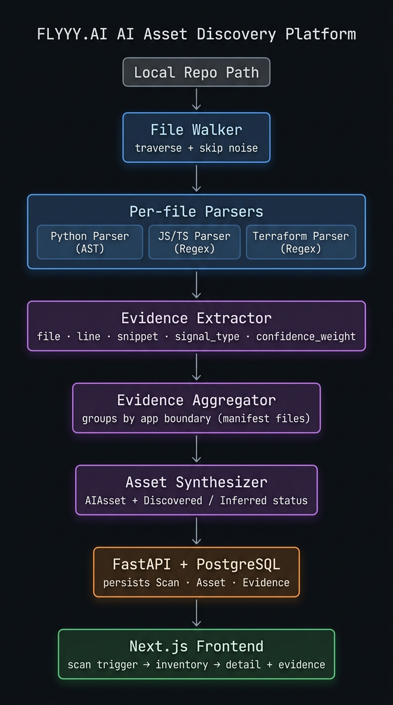

# FLYYY.AI — AI Asset Discovery Platform

> **FLYYY.AI Internship Assignment · Nithish Jude J · v1.0.0**

An end-to-end system that automatically discovers AI usage across a codebase and represents each discovery as a structured, evidence-backed "AI asset" in a centralized inventory — with full traceability back to the exact file and line of code.

---

**Live Deployment:** [https://your-deployment-link-here.vercel.app](https://your-deployment-link-here.vercel.app) (Placeholder)

---

## Architecture


*Create an Excalidraw diagram matching the architecture below, export it as `architecture.png`, and place it in the root folder!*

┌─────────────────────────────────────────────────────────────────────┐
│                        Discovery Pipeline                           │
│                                                                     │
│  Repo path ──► File Walker ──► Per-file Parsers                     │
│                    │               │                                │
│               (skip noise)    Python: ast module (precise)          │
│                               JS/TS:  regex (documented trade-off)  │
│                                   │                                 │
│                           Evidence Extractor                        │
│                  (raw Evidence records: file, line, snippet,        │
│                   signal_type, matched_value, confidence_weight)    │
│                                   │                                 │
│                        Evidence Aggregator                          │
│                  (groups by app boundary via manifest files)        │
│                                   │                                 │
│                         Asset Synthesizer                           │
│                  (merges → AIAsset + Discovered/Inferred status)    │
│                                   │                                 │
│                       FastAPI + PostgreSQL                          │
│                  (persists Scan, Asset, Evidence records)           │
│                                   │                                 │
│                        Next.js Frontend                             │
│                  (scan trigger → inventory → detail + evidence)     │
└─────────────────────────────────────────────────────────────────────┘
```

### Component Map
```
d:\fly\
├── testbed/                    # Sample environment (2 realistic apps)
│   ├── support-portal/         # Python + OpenAI GPT + LangGraph agent + Azure TF infra
│   └── doc-search/             # Python + sentence-transformers + FAISS
├── backend/
│   ├── app/
│   │   ├── scanner/            # Core discovery engine (no DB deps)
│   │   │   ├── known_signals.py        # Library/model/env/endpoint reference data
│   │   │   ├── file_walker.py          # Directory traversal + skip logic
│   │   │   ├── parsers/
│   │   │   │   ├── python_parser.py    # AST-based (precise)
│   │   │   │   ├── js_parser.py        # Regex-based (documented limitation)
│   │   │   │   └── tf_parser.py        # Regex-based Terraform HCL parser
│   │   │   ├── evidence_extractor.py   # Orchestrates parsers + manifest scanners
│   │   │   ├── evidence_aggregator.py  # Groups evidence by app boundary
│   │   │   └── asset_synthesizer.py    # Produces AIAsset + confidence model
│   │   ├── main.py             # FastAPI app
│   │   ├── database.py         # SQLAlchemy engine + session
│   │   ├── models.py           # ORM: Scan, Asset, Evidence
│   │   ├── schemas.py          # Pydantic v2 request/response shapes
│   │   └── routers/
│   │       ├── scans.py        # POST /scans, GET /scans/{id}
│   │       └── assets.py       # GET /assets, GET /assets/{id}
│   └── tests/                  # pytest unit + integration tests
├── frontend/                   # Next.js 15 App Router
│   ├── app/
│   │   ├── page.tsx            # Scan trigger (Client Component)
│   │   └── assets/
│   │       ├── page.tsx        # Asset inventory (Server Component)
│   │       └── [id]/page.tsx   # Asset detail + evidence (Server Component)
│   └── components/
│       ├── ScanForm.tsx        # Interactive scan form
│       ├── AssetCard.tsx       # Asset summary card
│       ├── EvidenceList.tsx    # Traceable evidence records
│       └── StatusBadge.tsx     # Discovered/Inferred/Pending badge
└── docker-compose.yml          # PostgreSQL service
```

---

## Setup & Running

### Prerequisites
- Python 3.11+
- Node.js 18+
- Docker (for PostgreSQL) — or change `DATABASE_URL` to an existing Postgres instance

### 1. Start PostgreSQL

```bash
docker-compose up -d
```

### 2. Backend

```bash
cd backend
python -m venv venv
.\venv\Scripts\activate          # Windows
# source venv/bin/activate       # macOS/Linux

pip install -r requirements.txt

# Copy env config
copy .env.example .env           # Windows
# cp .env.example .env           # macOS/Linux

# Start the API server
uvicorn app.main:app --reload --port 8000
```

API docs available at: http://localhost:8000/docs

### 3. Frontend

```bash
cd frontend
npm install
npm run dev
```

Frontend available at: http://localhost:3000

### 4. Run a Scan

1. Navigate to http://localhost:3000
2. Enter the absolute path to the testbed: `d:\fly\testbed` (or `d:/fly/testbed`)
3. Click **Run Scan**
4. Click **View Assets** to see the inventory

---

## API Surface

| Method | Endpoint | Description |
|---|---|---|
| `POST` | `/scans` | Trigger a scan against a local repo path |
| `GET` | `/scans/{id}` | Scan status + asset count |
| `GET` | `/assets` | List all assets (filterable by `scan_id`, `status`, `provider`) |
| `GET` | `/assets/{id}` | Full asset detail with nested `evidence[]` |

---

## Confidence / Status Model

Every asset has a `status` field determined by the evidence available:

| Status | Criteria | Confidence Range |
|---|---|---|
| **Discovered** | `LIBRARY_IMPORT` + `MODEL_NAME_STRING` both present | 70–90% |
| **Inferred** | Only `ENV_VAR_KEY`, `MANIFEST_DEPENDENCY`, or import without model name | 20–65% |
| **Pending Review** | Manually set (stretch goal) | — |

**Why this matters:** A `Discovered` asset is unambiguous — we know the library *and* the specific model. An `Inferred` asset is a strong signal that AI is used, but the details are incomplete (e.g., the model name is resolved at runtime via an env var we cannot statically evaluate).

---

## Design Decisions & Trade-offs

### AST Parsing vs. Regex vs. LLM-based Classification

Three approaches were considered for source code analysis:

| Approach | Precision | Dependencies | Speed | Chosen? |
|---|---|---|---|---|
| **Python `ast` module** | High — syntactically precise, skips comments | Zero (stdlib) | Fast | ✅ Python files |
| **Regex** | Medium — can false-positive on comments/strings | Zero | Fast | ✅ JS/TS files |
| **LLM-based classification** | Potentially highest (semantic understanding) | External API call, cost, latency | Slow | ❌ Not v1 |

**Decision:** Python files use AST parsing for high precision (no false positives from commented-out code). JS/TS files use regex because a full AST would require a Node.js subprocess or a Python binding with significant additional setup cost.

LLM-based classification was explicitly excluded for v1: it would add cost, latency, and an external API dependency to the scanner itself — a governance tool that scans AI code probably shouldn't *require* AI to operate.

### What Was Directly Discovered vs. Inferred

The scanner separates these explicitly:
- **Directly observed:** `import openai`, `model = "gpt-4o-mini"` → `status=Discovered`
- **Inferred/enriched:** provider derived from `OPENAI_API_KEY` env key (we know OpenAI is used but not which model) → `status=Inferred`

This distinction is visible in both the data model and the UI and is the core of the evidence-backed approach.

### Application Boundary Detection

The aggregator identifies app roots by locating `requirements.txt` / `package.json` files. This is a reliable heuristic for Python and Node.js projects. Monorepos with nested manifests are handled by stopping descent after the first manifest (each nested manifest = separate app boundary).

### Synchronous Scanning (v1)

Scans run synchronously within the FastAPI request. This is intentional for v1: it keeps the architecture simple and avoids the need for a task queue (Celery, Redis, etc.). A large monorepo (10,000+ files) would justify moving to async background tasks in v2.

---

## Known Limitations & Edge Cases

| Limitation | Impact | Mitigation |
|---|---|---|
| Dynamically constructed model names (`os.getenv("MODEL_NAME")`) | Model name not resolved; asset becomes `Inferred` | Document in asset detail: "Model not resolved — set at runtime" |
| JS/TS regex parsing misses template literals and dynamic requires | Some signals missed in complex JS | Documented trade-off; AST-based JS parser is v2 work |
| Python syntax errors fall back to regex scan | Lower confidence weight (0.7 vs 1.0) for those files | Fallback is documented with a reduced `confidence_weight` |
| Only Python + JS/TS + Terraform supported | Other languages (Go, Java, Ruby) not scanned | Documented out-of-scope for v1; language list in `known_signals.py` |
| Local paths only (no GitHub URL cloning in v1) | Requires manual clone | GitHub URL support is a clear v1.1 extension point |
| Cloud scanning via IaC only | Live cloud APIs (AWS Bedrock runtime, Lambda tags) not queried | Terraform static analysis catches declared resources; runtime discovery is v2 |

---

## Running Tests

```bash
cd backend
pytest tests/ -v
```

Tests cover:
- **`test_python_parser.py`** — AST signal extraction (imports, model names, env keys, fallback, line numbers)
- **`test_evidence_extractor.py`** — End-to-end extraction against testbed fixtures + skip-dir verification
- **`test_asset_synthesizer.py`** — Discovered/Inferred status logic, provider resolution, confidence scoring, full pipeline

---

## Testbed Description

| App | AI Library | Model | Signals Planted |
|---|---|---|---|
| `support-portal` | `openai`, `langgraph` | `gpt-4o-mini` | `import openai`, `from langgraph.graph import StateGraph`, model name string, `OPENAI_API_KEY`, `requirements.txt` dep |
| `support-portal` | Terraform IaC | Azure OpenAI | `azurerm_cognitive_account`, `azurerm_cognitive_deployment`, model name `"gpt-4o-mini"` in `infrastructure.tf` |
| `doc-search` | `sentence-transformers`, `faiss` | `all-MiniLM-L6-v2` | `from sentence_transformers import SentenceTransformer`, model name, `HF_TOKEN`, `requirements.txt` deps |

Each app has realistic non-AI utility functions (`formatter.py`, `text_cleaner.py`) and multiple routes to ensure the scanner must *locate* the signal rather than finding it trivially.

---

## Evaluation Alignment

| Criterion | Where addressed |
|---|---|
| Problem understanding / depth of research | This README; confidence model design section |
| System design | Architecture diagram; component map; pipeline description |
| Engineering quality | Scanner module boundaries; typed Pydantic models; pytest suite |
| Trade-off reasoning | "Design Decisions & Trade-offs" section above |
| Edge case handling | "Known Limitations & Edge Cases" table |
| Clarity of documentation | README mirrors PRD §2 Objectives structure |
